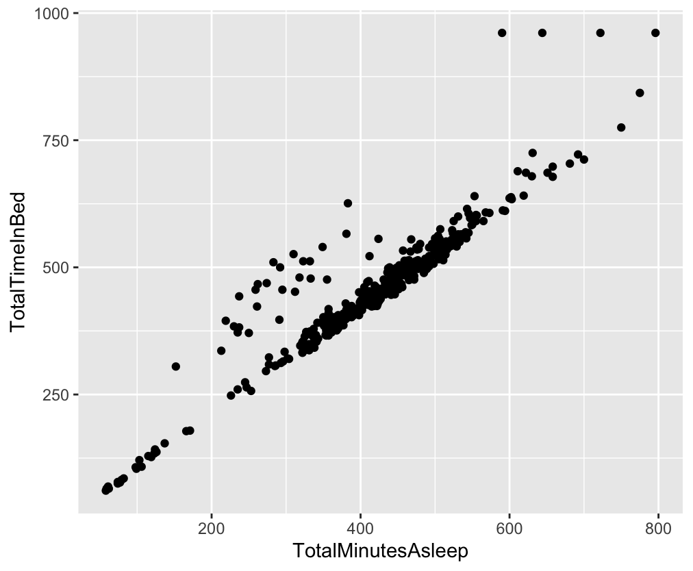
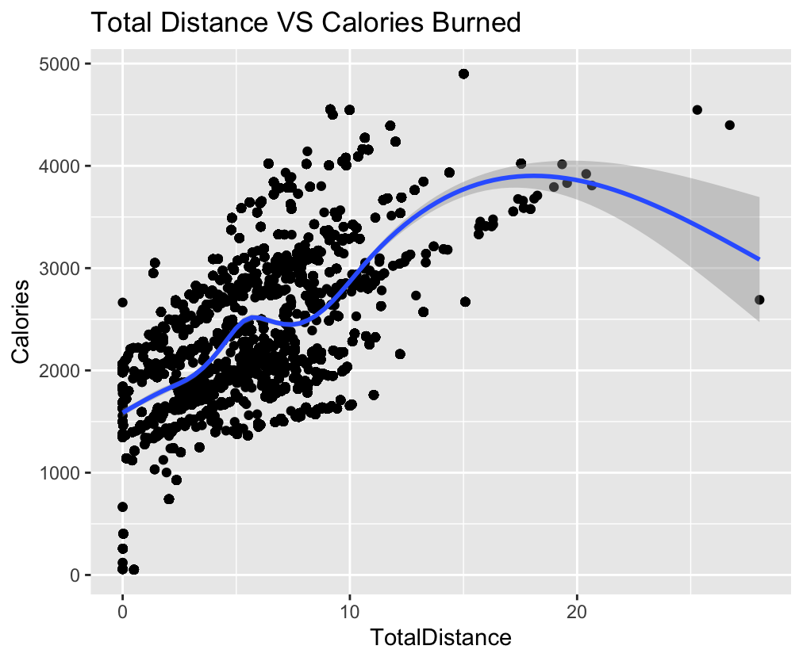

# Bellabeat Capstone Case Study

## Description
This capstone project analyzes smart device data to provide insights into consumer behavior and usage patterns for **Bellabeat**, a health-focused smart product manufacturer. The primary objective is to guide Bellabeat's marketing strategy by analyzing user activity, sleep patterns, and other metrics, leveraging the Bellabeat App as the product focus.

---

## Scenario
As a junior data analyst on the Bellabeat marketing analytics team, you were tasked with analyzing fitness and health data to:

1. Discover trends in smart device usage.
2. Apply insights to Bellabeat customers.
3. Shape Bellabeat's marketing strategies.

---

## Key Stakeholders
- **Urška Sršen**: Bellabeat’s cofounder and Chief Creative Officer
- **Sando Mur**: Bellabeat’s cofounder and mathematician
- **Bellabeat Marketing Analytics Team**: Responsible for collecting, analyzing, and reporting data for marketing strategies

---

## Datasets Used
Data for this project was sourced from Kaggle’s Fitbit dataset:
[https://www.kaggle.com/datasets/arashnic/fitbit](https://www.kaggle.com/datasets/arashnic/fitbit)

### Imported Datasets
- **DailyActivity**: Daily steps, distance, and calories burned
- **SleepDay**: Sleep patterns and durations
- **Weight**: Weight logs and BMI data
- **Other**: Additional datasets like heart rate, hourly steps, and intensities

---

## Tools and Packages
### Tools:
- **R Programming**: For data cleaning, visualization, and analysis

### R Packages Used:
- `tidyverse`
- `dplyr`
- `janitor`
- `lubridate`

---

## Key Insights
1. **Average Sedentary Time**: 16 hours/day (991 minutes)
2. **Activity Levels**: Most participants are lightly active
3. **Sleep Patterns**: Average sleep time is approximately 7 hours
4. **Caloric Burn**: Positive correlation between steps and calories burned

---

## Visualizations
### Total Minutes Asleep vs Total Time In Bed

- **Insight**: Strong linear relationship, suggesting users benefit from sleep notifications.

### Total Distance vs Calories Burned

- **Insight**: Distance traveled correlates positively with calories burned.

---

## Recommendations
- Market **consistent usage** of Bellabeat devices to improve health tracking.
- Highlight the correlation between physical activity and caloric burn.
- Promote sleep tracking features, emphasizing notifications to enhance sleep quality.

---

## Challenges with the Dataset
- **Limited Participants**: Only 33 participants, with just 8 in the weight dataset.
- **Missing Demographics**: No data on gender, height, or ethnicity.
- **Accuracy Concerns**: Potential discrepancies in tracker measurements.

---

## References
- [Harvard Health: Steps Per Day](https://www.health.harvard.edu/staying-healthy/how-many-steps-should-i-take-each-day)
- [CDC Sleep Recommendations](https://www.cdc.gov/sleep/about_sleep/how_much_sleep.html)

---

## Skills Demonstrated
- Data cleaning and merging using R.
- Exploratory Data Analysis (EDA) and statistical summary generation.
- Visualization using `ggplot2`.
- High-level insights and actionable recommendations for stakeholders.

---

## Tags
- #RProgramming
- #CapstoneProject
- #DataVisualization
- #HealthTracking
- #Bellabeat
